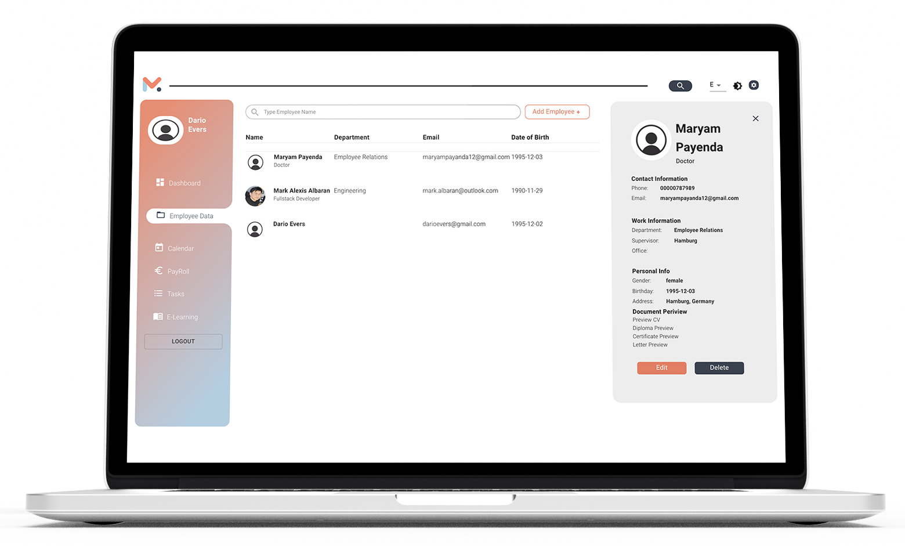

 

# **MPloy - Human Resource**

 

## **Final project for the DCI Web-Dev course**

MPloy is our groups final project for the DCI Web-Developer course. We are Maryam, Alex and Dario. After attending the full-time course for 11 months, we used the past 5 weeks to work on our final project and learned a lot on the way.

### **Our Idea**

We wanted to build a full-stack react app that is more flexible in its use. Thats why we came up with a visualized Data Management System aka MPloy HR Tool.

### **The Journey**

For the past 5 weeks we have planned, developed and brainstormed with a strict eye for design and useability. We have faced a number of bugs, but fixed them all.

 

 
Dashboardview

# **About MPloy**
## **Scale your team with thoughtful solutions**

MPloy is a Human Resource management tool with several useful tools implemented. Planning, tracking and delivering your team's best work has never been easier. Within one workspace you can post company-wide announcements, plan future tasks, access and edit employee records and manage the leave process entirely.

## **Key Features**
* **Internationalized** (English & German) via <a href="https://github.com/i18next/i18next" target="_blank">i18n</a>
* **Light & Dark Mode** via <a href="https://mui.com/" target="_blank"> MUI</a>
* **Login/Register/Reset Password**
* **Multiple User Groups** (Admin, HR Agent, Employee)
* **Task Management**
* **Calendar**
* **Admin Drawer**
* **Leave Applications**
* **Post Announcements**
* **Add & Edit Employee Records**
* **Document Upload**

 

## **Language Switch**

The language controller was build using i18next's technology. German and English are available and adding further languages can be done smoothly.

<a href="https://github.com/darioevers/Mploy-HR-Tool/blob/main/client/src/translations/languageSwitch.js" target="_blank">visit /languageSwitch.js</a>

 

## **Light & Dark Mode**

The theming was implemented using Material UI. We have created a theme library which holds the color palette for both light and dark mode. 

<a href="https://github.com/darioevers/Mploy-HR-Tool/blob/main/client/src/components/theme/theme.js" target="_blank">visit /theme.js</a>

 

## **Login & Register**

We have fully functional authentication through our server. You can login, register and reset your password via link send to the registered email address.

 

## **Multiple User Groups**

MPloy features multiple user groups with specified access rights to functions. Currently, there are HR Admins and Employees.

 

## **Task Management**

Set your own tasks and choose a priority for your task. Tasks can be sorted and marked as solved.

 

## **Calendar**

MPloy features a basic calendar that can hold future events.

 

## **Admin Drawer**

The admin drawer can be opened on desktop-only via the top right settings button and contains <em>Add New Admin</em>, <em>Post Announcement</em> & <em>Leave Applications</em>.

<b>See more</b>

 

## **Leave Applications**

Employees can easily request a leave on the webapp and select their dates and reason to submit. HR Agents can review the request and either approve or reject.

<b>See more</b>

Online Leave Form

 

 

## **Post Announcements**

You can post company-wide announcements via the Admin Drawer. Set a title, subtitle, message, date and author to post your message.

<b>See more</b>

View Announcements Mobile

 

## **Employee Records**

Access and edit your employee records easily from within one workspace. You can specify all information, upload documents and review leaves and holidays.

<b>See more</b>

View All Employees

 

Easily Edit Employee Records

 

# **Team**

Dario Evers

Front-End | UIUX | Design
 

 
 

Alex Albaran

Front-End | Back-End | UIUX
 

 
 

Maryam Payenda

Front-End | Back-End | Database
 

 